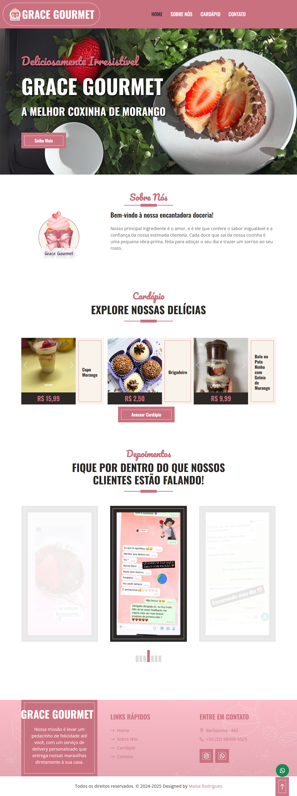

# Grace Gourmet - Delivery & Cardápio Digital 🍔🍕

  

Este repositório contém o código-fonte do site oficial do **Grace Gourmet**. O projeto foi desenvolvido para funcionar como um cardápio digital interativo e uma landing page de conversão, otimizada para o fluxo de pedidos via delivery.

## 🎯 Objetivo do Projeto
O foco principal foi a **facilidade de navegação**. Em sites de comida, o usuário quer rapidez. Por isso, a arquitetura de informação foi planejada para que o cliente encontre o produto, veja o preço e finalize o pedido com o menor número de cliques possível.

## 🚀 Tecnologias e Implementações
- **Frontend:** HTML5, CSS3 e JavaScript.
- **Visual Design:** Focado em cores que estimulam o apetite e fotos de alta qualidade para valorizar os pratos.
- **Mobile-First:** Prioridade total para dispositivos móveis, já que a maioria dos pedidos de delivery acontece via smartphone.
- **Integração de Pedidos:** Fluxo otimizado para direcionamento direto ao atendimento via WhatsApp, facilitando a gestão do estabelecimento.

## 📂 Funcionalidades
- **Cardápio Interativo:** Organização por categorias para facilitar a escolha.
- **Destaques do Dia:** Seção para promoções e itens mais vendidos.
- **Informações de Entrega:** Espaço claro para horários de funcionamento, taxas e áreas de atendimento.
- **CTA de Conversão:** Botões de "Pedir Agora" estrategicamente posicionados.

## 🌐 Link do Projeto
Confira o cardápio online: [deliverygracegourmet.com.br](https://deliverygracegourmet.com.br/)

---
Desenvolvido por **Maisa Rodrigues**
